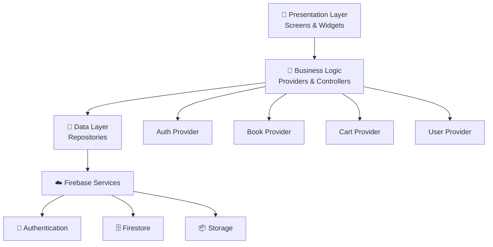
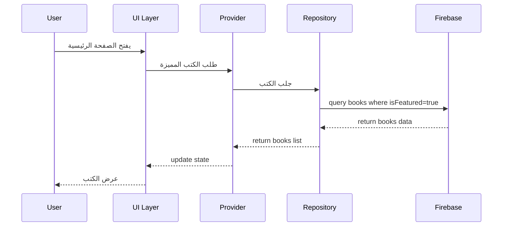
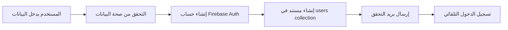
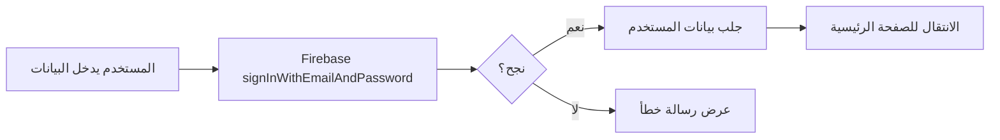

# 📚 خطة تنفيذ متكاملة: تطبيق متجر الكتب الإلكتروني

## نظرة عامة

تطبيق متجر كتب إلكتروني شامل يتيح للمستخدمين تصفح وشراء وقراءة الكتب الإلكترونية، مع نظام إدارة كامل للمستخدمين والمصادقة باستخدام Firebase.

---

## 🎯 الأهداف الرئيسية

1. **تطبيق سهل الاستخدام** لتصفح وشراء الكتب
2. **نظام مصادقة آمن** باستخدام Firebase Authentication
3. **قاعدة بيانات مرنة** باستخدام Cloud Firestore
4. **واجهة جذابة وعصرية** تشجع على القراءة
5. **تجربة مستخدم سلسة** من التسجيل حتى القراءة

---

## 👥 أنواع المستخدمين

### 1. **المستخدم العادي** (Reader)
- تصفح الكتب
- شراء الكتب
- قراءة الكتب المشتراة
- إدارة المكتبة الشخصية
- كتابة مراجعات

### 2. **المدير/الناشر** (Admin)
- إضافة كتب جديدة
- تعديل وحذف الكتب
- إدارة الفئات
- مراجعة التقييمات
- عرض الإحصائيات

---

## ✨ الميزات الأساسية

### 🔐 نظام المصادقة والمستخدمين

#### التسجيل وتسجيل الدخول:
- ✅ التسجيل بالبريد الإلكتروني وكلمة المرور
- ✅ تسجيل الدخول بالبريد الإلكتروني
- ✅ تسجيل الدخول بحساب Google
- ✅ استعادة كلمة المرور
- ✅ التحقق من البريد الإلكتروني
- ✅ تحديث الملف الشخصي (الاسم، الصورة، السيرة)

#### الصلاحيات:
- مستخدم عادي (user)
- مدير (admin)

### 📚 إدارة الكتب

#### عرض الكتب:
- الصفحة الرئيسية مع الكتب المميزة
- قائمة جميع الكتب
- التصنيف حسب الفئات (روايات، علمية، دينية، تقنية، إلخ)
- البحث عن كتب (بالعنوان، المؤلف، الناشر)
- الفلترة (السعر، التقييم، الأحدث، الأكثر مبيعاً)

#### تفاصيل الكتاب:
- الغلاف عالي الجودة
- العنوان والمؤلف
- الوصف والنبذة
- السعر
- التقييم والمراجعات
- عدد الصفحات
- اللغة
- تاريخ النشر
- الفئة

#### إدارة الكتب (للمدير):
- إضافة كتاب جديد
- تعديل معلومات الكتاب
- حذف كتاب
- رفع ملف PDF للكتاب
- رفع صورة الغلاف

### 🛒 سلة التسوق والشراء

- إضافة كتب إلى السلة
- عرض السلة
- تعديل الكمية (إذا كانت نسخ متعددة)
- حذف من السلة
- حساب الإجمالي
- إتمام الشراء (محاكاة)
- سجل المشتريات

### 📖 المكتبة الشخصية

- عرض جميع الكتب المشتراة
- البحث في المكتبة
- فتح الكتاب للقراءة
- إضافة كتب إلى المفضلة
- قائمة القراءة (Reading List)

### ⭐ التقييمات والمراجعات

- تقييم الكتب (1-5 نجوم)
- كتابة مراجعة نصية
- عرض مراجعات المستخدمين الآخرين
- الإعجاب بالمراجعات
- حذف المراجعة الخاصة

### 📊 لوحة التحكم (للمدير)

- عدد الكتب الكلي
- عدد المستخدمين
- إجمالي المبيعات
- الكتب الأكثر مبيعاً
- إحصائيات الفئات

---

## 🗂️ تصميم قاعدة البيانات Firebase Firestore

### Collections الرئيسية:

#### 1. **users** (المستخدمون)
```javascript
users/{userId}
{
  uid: string,              // Firebase Auth UID
  email: string,
  displayName: string,
  photoURL: string?,
  bio: string?,
  role: string,             // 'user' أو 'admin'
  createdAt: timestamp,
  updatedAt: timestamp,
  totalPurchases: number,   // عدد الكتب المشتراة
  favoriteGenres: array?    // الفئات المفضلة
}
```

#### 2. **books** (الكتب)
```javascript
books/{bookId}
{
  id: string,               // auto-generated
  title: string,
  author: string,
  description: string,
  price: number,
  coverImageURL: string,    // رابط صورة الغلاف
  pdfURL: string?,          // رابط ملف PDF
  category: string,         // الفئة
  language: string,         // اللغة
  pages: number,            // عدد الصفحات
  publisher: string?,       // الناشر
  publishDate: timestamp?,
  isbn: string?,
  rating: number,           // متوسط التقييم (0-5)
  ratingsCount: number,     // عدد التقييمات
  purchaseCount: number,    // عدد المشتريات
  isFeatured: boolean,      // مميز في الصفحة الرئيسية
  createdAt: timestamp,
  updatedAt: timestamp,
  addedBy: string?          // UID المدير الذي أضاف الكتاب
}
```

#### 3. **categories** (الفئات)
```javascript
categories/{categoryId}
{
  id: string,
  name: string,             // اسم الفئة
  nameEn: string?,          // الاسم بالإنجليزية
  description: string?,
  iconURL: string?,
  booksCount: number,       // عدد الكتب في هذه الفئة
  order: number?            // ترتيب العرض
}
```

#### 4. **purchases** (المشتريات)
```javascript
purchases/{purchaseId}
{
  id: string,
  userId: string,           // ref to users
  bookId: string,           // ref to books
  bookTitle: string,        // نسخة من العنوان
  bookCoverURL: string,
  price: number,            // السعر وقت الشراء
  purchaseDate: timestamp,
  status: string            // 'completed', 'pending'
}
```

#### 5. **reviews** (المراجعات)
```javascript
reviews/{reviewId}
{
  id: string,
  bookId: string,           // ref to books
  userId: string,           // ref to users
  userName: string,
  userPhotoURL: string?,
  rating: number,           // 1-5
  reviewText: string?,
  createdAt: timestamp,
  updatedAt: timestamp?,
  likesCount: number,       // عدد الإعجابات
  likedBy: array?           // مصفوفة UIDs
}
```

#### 6. **cart** (السلة)
```javascript
cart/{userId}/items/{bookId}
{
  bookId: string,
  bookTitle: string,
  bookCoverURL: string,
  price: number,
  addedAt: timestamp
}
```

#### 7. **favorites** (المفضلة)
```javascript
favorites/{userId}/books/{bookId}
{
  bookId: string,
  addedAt: timestamp
}
```

---

## 🏗️ معمارية التطبيق (Architecture)

### نمط المعمارية: **Clean Architecture + Provider**

```
lib/
├── core/
│   ├── constants/
│   │   ├── app_colors.dart
│   │   ├── app_strings.dart
│   │   └── app_routes.dart
│   ├── utils/
│   │   ├── validators.dart
│   │   └── helpers.dart
│   └── widgets/
│       ├── custom_button.dart
│       ├── custom_text_field.dart
│       ├── loading_widget.dart
│       └── error_widget.dart
│
├── data/
│   ├── models/
│   │   ├── user_model.dart
│   │   ├── book_model.dart
│   │   ├── category_model.dart
│   │   ├── purchase_model.dart
│   │   └── review_model.dart
│   └── repositories/
│       ├── auth_repository.dart
│       ├── book_repository.dart
│       ├── user_repository.dart
│       └── purchase_repository.dart
│
├── presentation/
│   ├── providers/
│   │   ├── auth_provider.dart
│   │   ├── book_provider.dart
│   │   ├── cart_provider.dart
│   │   └── theme_provider.dart
│   └── screens/
│       ├── auth/
│       │   ├── login_screen.dart
│       │   ├── register_screen.dart
│       │   └── forgot_password_screen.dart
│       ├── home/
│       │   ├── home_screen.dart
│       │   └── widgets/
│       ├── books/
│       │   ├── books_list_screen.dart
│       │   ├── book_details_screen.dart
│       │   └── book_reader_screen.dart
│       ├── cart/
│       │   └── cart_screen.dart
│       ├── library/
│       │   └── my_library_screen.dart
│       ├── profile/
│       │   └── profile_screen.dart
│       └── admin/
│           ├── admin_dashboard.dart
│           └── add_edit_book_screen.dart
│
└── main.dart
```

---

## 🎨 تصميم واجهات المستخدم (UI/UX)

### الشاشات الرئيسية:

#### 1️⃣ شاشة التسجيل والدخول
```
┌─────────────────────────┐
│   📚 متجر الكتب        │
│                         │
│   [Logo]                │
│                         │
│   البريد الإلكتروني    │
│   [_______________]     │
│                         │
│   كلمة المرور           │
│   [_______________]     │
│                         │
│   [  تسجيل الدخول  ]    │
│                         │
│   [ تسجيل بـ Google ]   │
│                         │
│   نسيت كلمة المرور؟     │
│   ليس لديك حساب؟ سجّل   │
└─────────────────────────┘
```

#### 2️⃣ الصفحة الرئيسية
```
┌─────────────────────────────┐
│ ☰  متجر الكتب      🔍 👤  │
├─────────────────────────────┤
│                             │
│  ━━━ الكتب المميزة ━━━     │
│  [Horizontal Slider]        │
│  [📚] [📕] [📗] [📘]        │
│                             │
│  ━━━ الفئات ━━━             │
│  [روايات] [علمية] [دينية]  │
│                             │
│  ━━━ الأكثر مبيعاً ━━━      │
│  ┌──────┐ ┌──────┐         │
│  │ 📚   │ │ 📕   │         │
│  │Title │ │Title │         │
│  │⭐4.5 │ │⭐4.8 │         │
│  │$9.99 │ │$12   │         │
│  └──────┘ └──────┘         │
└─────────────────────────────┘
```

#### 3️⃣ تفاصيل الكتاب
```
┌─────────────────────────────┐
│  ← متجر الكتب        🛒 ❤  │
├─────────────────────────────┤
│                             │
│      ┌──────────────┐       │
│      │              │       │
│      │   [Cover]    │       │
│      │              │       │
│      └──────────────┘       │
│                             │
│  عنوان الكتاب الرائع        │
│  by المؤلف                  │
│                             │
│  ⭐⭐⭐⭐⭐ 4.5 (120 تقييم)   │
│                             │
│  $12.99                     │
│                             │
│  [ إضافة إلى السلة 🛒 ]     │
│                             │
│  ━━━ الوصف ━━━              │
│  نبذة عن الكتاب...         │
│                             │
│  ━━━ التفاصيل ━━━           │
│  📄 الصفحات: 320            │
│  🏷️ الفئة: روايات           │
│  🌍 اللغة: عربي             │
│                             │
│  ━━━ المراجعات ━━━          │
│  [قائمة المراجعات]          │
└─────────────────────────────┘
```

#### 4️⃣ السلة
```
┌─────────────────────────────┐
│  ← السلة                    │
├─────────────────────────────┤
│                             │
│  ┌─────────────────────┐    │
│  │ 📚 [Cover] Title    │    │
│  │    المؤلف           │    │
│  │    $9.99        [×] │    │
│  └─────────────────────┘    │
│                             │
│  ┌─────────────────────┐    │
│  │ 📕 [Cover] Title    │    │
│  │    المؤلف           │    │
│  │    $12.00       [×] │    │
│  └─────────────────────┘    │
│                             │
│  ━━━━━━━━━━━━━━━━━━━━━━━   │
│  الإجمالي: $21.99          │
│                             │
│  [    إتمام الشراء    ]    │
└─────────────────────────────┘
```

#### 5️⃣ مكتبتي
```
┌─────────────────────────────┐
│  مكتبتي            🔍       │
├─────────────────────────────┤
│                             │
│  [الكل] [المفضلة] [المقروءة]│
│                             │
│  ┌──────┐ ┌──────┐ ┌──────┐│
│  │ 📚   │ │ 📕   │ │ 📗   ││
│  │Title │ │Title │ │Title ││
│  │[قراءة]│ │[قراءة]│ │[قراءة]││
│  └──────┘ └──────┘ └──────┘│
│                             │
│  ┌──────┐ ┌──────┐         │
│  │ 📘   │ │ 📙   │         │
│  │Title │ │Title │         │
│  │[قراءة]│ │[قراءة]│         │
│  └──────┘ └──────┘         │
└─────────────────────────────┘
```

#### 6️⃣ لوحة التحكم (Admin)
```
┌─────────────────────────────┐
│  لوحة التحكم               │
├─────────────────────────────┤
│                             │
│  ┌──────┐ ┌──────┐ ┌──────┐│
│  │ 📚   │ │ 👥   │ │ 💰   ││
│  │ 150  │ │ 1.2k │ │$5.4k ││
│  │ كتاب │ │مستخدم│ │مبيعات││
│  └──────┘ └──────┘ └──────┘│
│                             │
│  [+ إضافة كتاب جديد]        │
│                             │
│  ━━━ الكتب الأخيرة ━━━      │
│  📚 كتاب 1      [✏️] [🗑️] │
│  📕 كتاب 2      [✏️] [🗑️] │
│  📗 كتاب 3      [✏️] [🗑️] │
│                             │
│  ━━━ الأكثر مبيعاً ━━━      │
│  [رسم بياني]                │
└─────────────────────────────┘
```

---

## 📊 مخططات النظام

### 1. Use Case Diagram (مخطط حالات الاستخدام)

```mermaid
graph TB
    User["👤 المستخدم العادي"]
    Admin["👨‍💼 المدير"]
    
    User --> Browse["تصفح الكتب"]
    User --> Search["البحث عن كتب"]
    User --> ViewDetails["عرض تفاصيل كتاب"]
    User --> AddToCart["إضافة إلى السلة"]
    User --> Purchase["شراء كتب"]
    User --> ReadBook["قراءة كتاب"]
    User --> Review["كتابة مراجعة"]
    User --> ManageProfile["إدارة الملف الشخصي"]
    User --> ViewLibrary["عرض المكتبة"]
    
    Admin --> AddBook["إضافة كتاب"]
    Admin --> EditBook["تعديل كتاب"]
    Admin --> DeleteBook["حذف كتاب"]
    Admin --> ViewStats["عرض الإحصائيات"]
    Admin --> ManageCategories["إدارة الفئات"]
    Admin --> ManageUsers["إدارة المستخدمين"]
```



### 2. Architecture Diagram (المعمارية)



### 3. Data Flow Diagram (تدفق البيانات)



---

## 🔐 نظام المصادقة (Authentication Flow)

### تدفق التسجيل:


### تدفق تسجيل الدخول:


---

## 📦 الحزم المطلوبة (Dependencies)

```yaml
dependencies:
  flutter:
    sdk: flutter
  
  # Firebase
  firebase_core: ^2.24.2
  firebase_auth: ^4.15.3
  cloud_firestore: ^4.13.6
  firebase_storage: ^11.5.6
  
  # State Management
  provider: ^6.1.1
  
  # UI/UX
  google_fonts: ^6.1.0
  cached_network_image: ^3.3.0
  flutter_svg: ^2.0.9
  shimmer: ^3.0.0
  flutter_rating_bar: ^4.0.1
  carousel_slider: ^4.2.1
  
  # Authentication
  google_sign_in: ^6.1.6
  
  # PDF Reader
  syncfusion_flutter_pdfviewer: ^24.1.41
  # أو
  flutter_pdfview: ^1.3.2
  
  # Image Picker (للمدير)
  image_picker: ^1.0.5
  
  # Utils
  intl: ^0.19.0
  url_launcher: ^6.2.2
  share_plus: ^7.2.1
  
  # Loading & Animations
  flutter_spinkit: ^5.2.0
  lottie: ^2.7.0
```

---

## 🛠️ خطوات التنفيذ

### المرحلة 1: الإعداد (يوم 1-2) ✅
- [ ] إنشاء مشروع Flutter جديد
- [ ] إعداد Firebase Project
- [ ] إضافة Firebase للتطبيق (Android & iOS)
- [ ] تنصيب جميع الحزم المطلوبة
- [ ] إعداد هيكل المجلدات

### المرحلة 2: النماذج والـ Repositories (يوم 2-3) ✅
- [ ] إنشاء نماذج البيانات (Models)
- [ ] إنشاء Repositories
- [ ] إعداد Firebase Collections
- [ ] اختبار الاتصال مع Firebase

### المرحلة 3: نظام المصادقة (يوم 3-5) 🔐
- [ ] شاشة تسجيل الدخول
- [ ] شاشة التسجيل
- [ ] استعادة كلمة المرور
- [ ] تسجيل الدخول بـ Google
- [ ] AuthProvider
- [ ] التحقق من حالة المصادقة

### المرحلة 4: الواجهات الأساسية (يوم 5-10) 🎨
- [ ] الصفحة الرئيسية
- [ ] قائمة الكتب
- [ ] تفاصيل الكتاب
- [ ] السلة
- [ ] المكتبة الشخصية
- [ ] الملف الشخصي
- [ ] البحث

### المرحلة 5: وظائف المستخدم (يوم 10-14) ⚙️
- [ ] إضافة إلى السلة
- [ ] إتمام الشراء
- [ ] عرض الكتب المشتراة
- [ ] قراءة PDF
- [ ] المفضلة
- [ ] التقييمات والمراجعات

### المرحلة 6: لوحة التحكم (Admin) (يوم 14-17) 👨‍💼
- [ ] Dashboard
- [ ] إضافة كتاب
- [ ] تعديل كتاب
- [ ] حذف كتاب
- [ ] رفع الصور والـ PDF
- [ ] الإحصائيات

### المرحلة 7: التحسينات والتجميل (يوم 17-19) ✨
- [ ] Dark Mode
- [ ] Animations
- [ ] Loading States
- [ ] Error Handling
- [ ] تحسين الأداء

### المرحلة 8: الاختبار والنشر (يوم 19-21) 🚀
- [ ] اختبار شامل
- [ ] إصلاح الأخطاء
- [ ] التوثيق
- [ ] إعداد العرض التقديمي

---

## 🎨 نظام الألوان المقترح

```dart
class AppColors {
  // Primary Colors
  static const primaryColor = Color(0xFF6366F1);      // Indigo
  static const secondaryColor = Color(0xFFF59E0B);    // Amber
  
  // Background
  static const backgroundColor = Color(0xFFF9FAFB);
  static const cardColor = Color(0xFFFFFFFF);
  
  // Text
  static const textPrimary = Color(0xFF111827);
  static const textSecondary = Color(0xFF6B7280);
  
  // Status
  static const successColor = Color(0xFF10B981);
  static const errorColor = Color(0xFFEF4444);
  static const warningColor = Color(0xFFF59E0B);
  
  // Dark Mode
  static const darkBackground = Color(0xFF111827);
  static const darkCard = Color(0xFF1F2937);
}
```

---

## 📱 Responsive Design

التطبيق يجب أن يدعم:
- 📱 الهواتف (Portrait & Landscape)
- 📱 الأجهزة اللوحية
- 🖥️ الويب (اختياري)

---

## 🔒 الأمان (Security Rules)

### Firestore Security Rules:

```javascript
rules_version = '2';
service cloud.firestore {
  match /databases/{database}/documents {
    
    // Users
    match /users/{userId} {
      allow read: if request.auth != null;
      allow write: if request.auth.uid == userId;
    }
    
    // Books
    match /books/{bookId} {
      allow read: if true;
      allow create, update, delete: if request.auth != null && 
        get(/databases/$(database)/documents/users/$(request.auth.uid)).data.role == 'admin';
    }
    
    // Purchases
    match /purchases/{purchaseId} {
      allow read: if request.auth != null && resource.data.userId == request.auth.uid;
      allow create: if request.auth != null && request.resource.data.userId == request.auth.uid;
    }
    
    // Reviews
    match /reviews/{reviewId} {
      allow read: if true;
      allow create: if request.auth != null;
      allow update, delete: if request.auth != null && resource.data.userId == request.auth.uid;
    }
    
    // Cart
    match /cart/{userId}/items/{bookId} {
      allow read, write: if request.auth != null && request.auth.uid == userId;
    }
    
    // Favorites
    match /favorites/{userId}/books/{bookId} {
      allow read, write: if request.auth != null && request.auth.uid == userId;
    }
  }
}
```

---

## 📝 ملاحظات مهمة

> [!IMPORTANT]
> **Firebase Storage**
> - استخدم Firebase Storage لرفع الصور والملفات PDF
> - نظّم المجلدات: `/books/covers/` و `/books/pdfs/`

> [!TIP]
> **الأداء**
> - استخدم Pagination للكتب (عرض 20 كتاب في كل صفحة)
> - استخدم `cached_network_image` للصور
> - استخدم Indexes في Firestore للبحث السريع

> [!WARNING]
> **التكاليف**
> - Firebase لديه خطة مجانية محدودة
> - راقب عدد القراءات/الكتابات في Firestore
> - لا ترفع ملفات PDF كبيرة جداً (أقل من 50MB)

---

## 🎓 للعرض الجامعي

### ما يجب التركيز عليه:
1. ✅ **التصميم الجميل** - اجعل الواجهة مبهرة
2. ✅ **تدفق المستخدم** - أظهر كيف يستخدم التطبيق بسلاسة
3. ✅ **نظام المصادقة** - اشرح الأمان والصلاحيات
4. ✅ **قاعدة البيانات** - اعرض بنية Firestore
5. ✅ **الميزات الفريدة** - مثل قراءة PDF ونظام التقييمات

### العرض التقديمي:
1. مقدمة عن المشكلة والحل
2. عرض الميزات الرئيسية
3. Demo مباشر للتطبيق
4. شرح التقنيات المستخدمة
5. المعمارية وقاعدة البيانات
6. الخلاصة والتطويرات المستقبلية

---

## 🚀 التطويرات المستقبلية (اختيارية)

- 💳 بوابة دفع حقيقية (Stripe, PayPal)
- 📧 نظام إشعارات
- 🔊 الكتب الصوتية
- 🌐 نسخة ويب كاملة
- 🤖 توصيات ذكية بالذكاء الاصطناعي
- 📊 تحليلات متقدمة
- 🎁 نظام كوبونات وخصومات
- 👥 مجتمع القراء والمناقشات

---

**هل أنت مستعد للبدء؟ 🚀**
